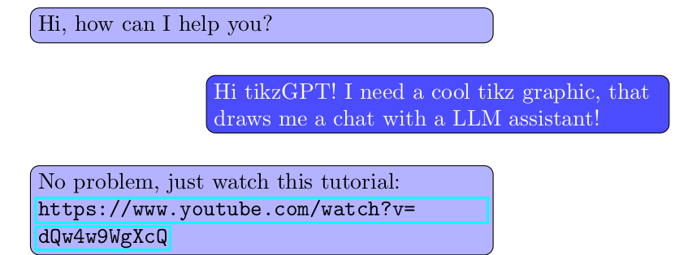

# tikz-chat-template

> A LaTeX template to draw chats with TikZ


```tex
\chat{{
assistant/{Hi, how can I help you?},
user/{Hi tikzGPT! I need a cool tikz graphic, that draws me a chat with a LLM assistant!},
assistant/{No problem, just watch this tutorial:\\\url{https://www.youtube.com/watch?v=dQw4w9WgXcQ}}
}}
```


